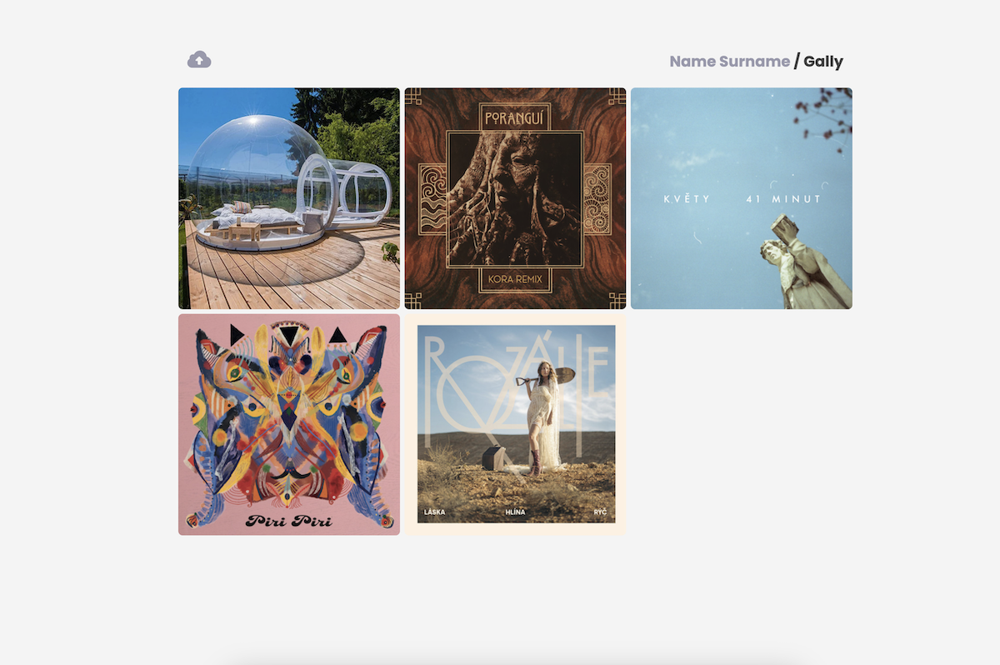

### Gally - simple photo feed for your website

### Installation
Simply upload the whole folder onto your server running PHP. It will create its folders (`upload/` and `thumbs/`).

It needs to be able to write files. Make sure to have a high-enough limit in your PHP configuration (php.ini) for: (12MB will be enough for sure)
- `upload_max_filesize`
- `post_max_size`

### Configuration
All you need to set is your name for the header and password for upload.
There is no site-wide login, just a password field on the upoad page, keeping the logic minimal. Check out the `config.php`:

`define('UPLOAD_PASSWORD', 'password');`  
`define('HEADER_NAME', 'Name Surname');`

### Under the hood
- each uploaded photo is kept in its original file size, that is presented on the _detail_ page
- during the upload, it generates a thumbnail for the homepage
- file name is the timestamp, from which the date on the _detail_ page is displayed, as well as the order on the homepage
- each upload also creates same-named json file to keep the photo description and view count
- on the _detail_ page, those meta data are retrieved and the view count is incremented back into the json

### Contact
Feel free to reach me at _adam@rajnoha.com_